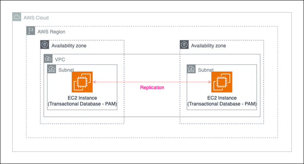
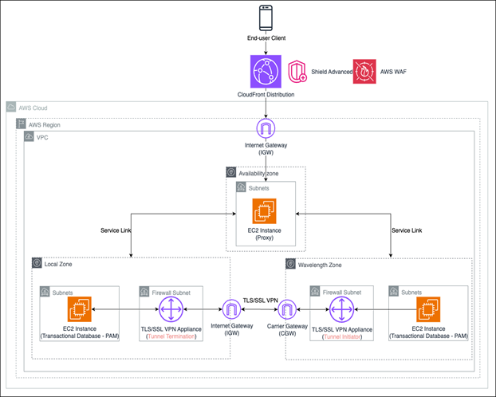
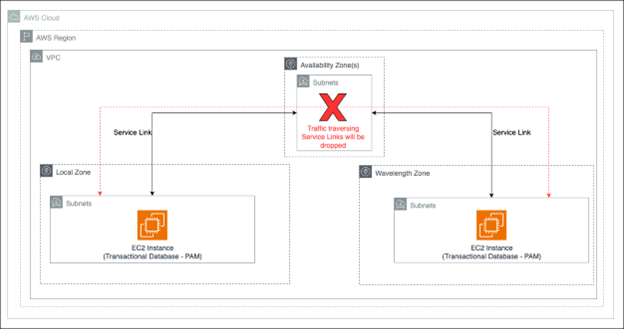
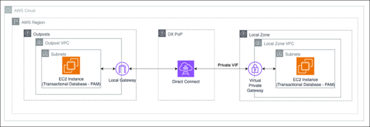
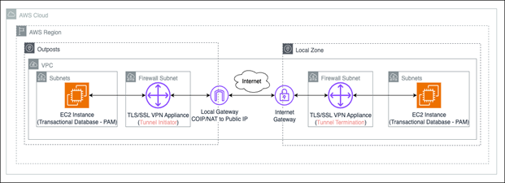
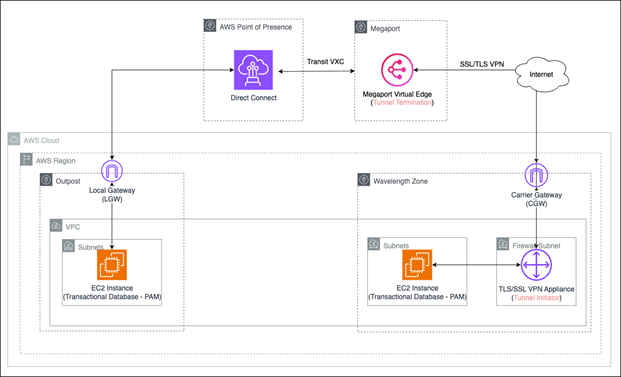

# Thiết kế ứng dụng cá cược và trò chơi một cách hợp pháp và bảo mật trên AWS

> **📖 Bài viết gốc**: [Designing compliant and secure betting and gaming applications on AWS](https://aws.amazon.com/vi/blogs/gametech/designing-compliant-and-secure-betting-and-gaming-applications-on-aws/)  
> **👤 Tác giả**: Gena Gizzi, Nicholas Drane, và Peter Siddle  
> **📅 Ngày xuất bản**: 27/02/2024  
> **🌐 Nguồn**: AWS GameTech Blog  
> **👨‍💻 Người dịch**: Trương Nguyên Chương - FCJ Intern  
> **📅 Ngày dịch**: 03/01/2026  
> **⏱️ Thời gian đọc**: 12 phút

---

## 📋 Tóm tắt

Bài viết tập trung vào việc giải quyết các thách thức về quy định pháp lý và kỹ thuật trong ngành cá cược và trò chơi (Betting & Gaming - B&G). Nội dung chính xoay quanh cách các nhà vận hành có thể sử dụng kiến trúc lai (Hybrid Architecture) của AWS để đáp ứng yêu cầu về chủ quyền dữ liệu của địa phương mà vẫn đảm bảo hiệu suất mạng cao và độ trễ thấp. Bài viết phân tích chi tiết 5 mẫu kiến trúc phục hồi thảm họa (Disaster Recovery) sử dụng kết hợp các dịch vụ AWS Region, Local Zones, Wavelength Zones và Outposts. Thông qua các sơ đồ luồng dữ liệu North-South và East-West, người đọc sẽ hiểu cách thiết lập kết nối an toàn, bảo mật và tuân thủ các quy tắc nghiêm ngặt của chính quyền địa phương.

**🎯 Đối tượng đọc**: Kiến trúc sư hệ thống, kỹ sư DevOps, nhà vận hành ứng dụng cá cược và trò chơi.  
**📊 Độ khó**: Intermediate  
**🏷️ Tags**: AWS, Betting and Gaming, Hybrid Cloud, Disaster Recovery, Compliance, Edge Computing.

---

## 📚 Mục lục

- [Phần 1: Thiết kế ứng dụng cá cược và trò chơi một cách hợp pháp và bảo mật trên AWS](#phần-1-thiết-kế-ứng-dụng-cá-cược-và-trò-chơi-một-cách-hợp-pháp-và-bảo-mật-trên-aws)
- [Phần 2: Các mẫu kiến trúc đảm bảo khả năng phục hồi](#phần-2-các-mẫu-kiến-trúc-đảm-bảo-khả-năng-phục-hồi)
- [Phần 3: Chi tiết 5 phương án triển khai](#1-triển-khai-trên-region)
- [Kết luận](#kết-luận)
- [Glossary - Thuật ngữ](#-glossary---thuật-ngữ)
- [Tài liệu tham khảo](#-tài-liệu-tham-khảo)

---

# Phần 1: Thiết kế ứng dụng cá cược và trò chơi một cách hợp pháp và bảo mật trên AWS

Trong ngành công nghiệp cá cược và trò chơi, nhà vận hành buộc phải tuân thủ các quy định quản lý phức tạp trong khi duy trì chất lượng trải nghiệm người dùng. Các cơ quan chính phủ địa phương thường đưa ra các luật lệ về nơi mà các tác vụ và dữ liệu được xử lý, điều này tạo ra một thách thức đối với các mô hình triển khai dịch vụ đám mây truyền thống.

Nhiều nhà vận hành trò chơi đã đạt được thành công khi triển khai kiến trúc lai kết hợp điện toán biên với các dịch vụ đám mây trên AWS. Với cách tiếp cận này, họ có thể xử lý dữ liệu gần hơn với người chơi với độ trễ thấp, trong khi vẫn xác nhận là đã tuân thủ các luật địa phương về chủ quyền dữ liệu.

Nhà vận hành của các tác vụ cá cược và trò chơi(B&G) bị giới hạn bởi các quy định pháp lý được đặt ra bởi chính quyền địa phương. Các quy định này đưa ra các hướng dẫn chi tiết về việc tác vụ nào được phép xảy ra trong quyền hạn pháp lý, hay thậm chí là vị trí mà các tác vụ này được phép hoạt động

Đối với các kháng hàng trong lĩnh vực B&G muốn tận dụng các khả năng của AWS Cloud, một cách tiếp cận thông thường là triển khai kết hợp AWS Local Zones, Wavelength Zones và AWS Outposts cùng với AWS Region. Chiến lược lai này cung cấp cho các tổ chức một phương thức để cung cấp hiệu năng với độ trễ thấp cho các ứng dụng hướng tới khách hàng, đồng thời tuân thủ các quy định về lưu trữ dữ liệu

Kiến trúc lai trên AWS cung cấp một giải pháp hai phần:
1. Các thành phần bị luật pháp quản lý phải chạy ở biên nhằm đáp ứng các yêu cầu, quy định của địa phương
2. Các tác vụ không bị quản lý được sử dụng hạ tầng AWS tại địa phương

Kiến trúc này cho phép nhà vận hành truy cập đầy đủ các dịch vụ đám mây AWS cũng như hưởng lợi từ khả năng mở rộng của dịch vụ. Mô hình triển khai lai (được xây dựng dựa trên hệ thống hạ tầng AWS toàn cầu) quản lý cơ sở vật chất và sắp xếp kiến trúc hệ thống bằng cách cung cấp nhà vận hành với API và dịch vụ thiết yếu ở khắp các địa điểm 

Các dịch vụ lai và điện toán biên của AWS cung cấp đến các nhà vận hành B&G một giải pháp đáp ứng các yêu cầu về lưu trữ dữ liệu và hiệu suất mạng. Các mô hình đại diện cho duy nhất một vị trí địa lý, khiến các nhà vận hành cần thiết phải thiết kế các kiến trúc đáp ứng nhu cầu về độ bền của khách hàng. Sử dụng các triển khai khách hàng B&G làm nghiên cứu trường hợp, hãy cùng xem xét một số mẫu kiến trúc cho Phục hồi Thảm họa cấp Site (Site-level Disaster Recovery - DR) bằng cách sử dụng các dịch vụ lai và biên của AWS

## Phần 2: Các mẫu kiến trúc đảm bảo khả năng phục hồi
Thuật ngữ khả năng phục hồi (resiliency) đề cập đến cách một ứng dụng có thể phục hồi từ các sự cố hạ tầng trong khi vẫn đáp ứng được các mục tiêu Thời gian Phục hồi (Recovery Time Objective - RTO) và Điểm Phục hồi (Recovery Point Objective - RPO).

Không giống như các AWS Region, vốn chứa ba hoặc nhiều Availability Zone (AZ) với kết nối nội bộ sẵn có, phần lớn các vị trí có Local Zone hoặc Wavelength Zone hiện nay chỉ gồm một site duy nhất. Hơn nữa, AWS Outposts được triển khai tại các trung tâm dữ liệu do khách hàng lựa chọn.

Việc không xem xét tác động của các sự cố cụ thể tại site có thể dẫn đến gián đoạn dịch vụ kéo dài. Điều này có thể gây mất doanh thu đáng kể trong ngắn hạn và, nếu xảy ra thường xuyên, dẫn đến mất khách hàng trong dài hạn.

Khách hàng nên tận dụng AWS Region để lưu trữ các workload của B&G bất cứ khi nào có thể. Tuy nhiên, lựa chọn này không phải lúc nào cũng khả thi. Ví dụ, các nhà khai thác tại Hoa Kỳ có yêu cầu phải lưu trữ các thành phần workload được quy định trong phạm vi biên giới của từng bang mà họ hoạt động. Ở những bang không có AWS Region, khả năng phục hồi phải được đạt được bằng cách kết hợp các tùy chọn triển khai từ AWS Local Zones, AWS Wavelength Zones và AWS Outposts.

AWS Local Zones là các vị trí do AWS quản lý, nằm tại các khu vực đô thị lớn trên toàn thế giới. Tương tự, AWS Wavelength Zones giống với Local Zones, nhưng được lưu trữ tại trung tâm dữ liệu của đối tác Nhà cung cấp Dịch vụ Viễn thông (CSP) (như Verizon tại Hoa Kỳ). Cuối cùng, Outposts mang khả năng tính toán được quản lý đến vị trí trung tâm dữ liệu do khách hàng chỉ định.

Theo thứ tự ưu tiên của khách hàng, danh sách sau đây phác thảo các tổ hợp khác nhau mà khách hàng có thể sử dụng. Thứ tự này xuất phát từ các yếu tố chính như khối lượng quản lý, khả năng mở rộng theo nhu cầu và chi phí:
1. Triển khai trên Region (Ưu tiên cao nhất)
2. Triển khai trên Local Zone và Wavelength Zone
3. Triển khai trên Local Zone và Outpost
4. Triển khai trên Wavelength Zone và Outpost
5. Outpost cho site chính và site phụ

Để biết chi tiết về các dịch vụ nào khả dụng cho B&G tại một khu vực pháp lý cụ thể, vui lòng tham khảo ý kiến Đội ngũ Tài khoản AWS của bạn. Trong các phần tiếp theo, chúng tôi tập trung vào chi tiết triển khai cho từng tùy chọn và các bài học kinh nghiệm từ thực tế.

Khi chọn một tùy chọn, nên chạy thêm các bài kiểm tra để xác nhận rằng độ trễ đáp ứng yêu cầu của workload. Hơn nữa, hãy cân nhắc triển khai các thành phần không bị quy định (ví dụ: những thành phần không bị ràng buộc bởi yêu cầu khu vực pháp lý) trên AWS Region.

## 1. Triển khai trên Region
Nếu một AWS Region khả dụng và được phê duyệt sử dụng tại khu vực pháp lý đó, nó nên là lựa chọn đầu tiên để triển khai workload. Region cung cấp khả năng mở rộng lớn nhất cho tính toán và lưu trữ. Hơn nữa, các Availability Zone (AZ) mang lại con đường nhanh nhất để đạt được khả năng phục hồi, cho phép các thành phần workload có trạng thái (như cơ sở dữ liệu và cache) được đồng bộ hóa thông qua kết nối nội bộ có độ trễ thấp, thông lượng cao.

Tại Hoa Kỳ, Ohio là ví dụ mà các nhà khai thác B&G chọn sử dụng AWS Region để triển khai các thành phần workload được quy định.

Khách hàng sử dụng AWS Region, kết hợp với các vị trí hybrid và edge, cho chiến lược triển khai toàn diện nên cân nhắc chuẩn hóa trên một bộ dịch vụ và khả năng cốt lõi có sẵn ở tất cả các vị trí. Điều này giúp đơn giản hóa quản lý pipeline và tạo sự nhất quán trong hiệu suất workload giữa các vị trí khác nhau, bất kể mô hình triển khai.

_Hình 1: Kiến trúc khả năng phục hồi dựa trên AWS Region sử dụng nhiều Availability Zone._

Sơ đồ trên cho thấy cái nhìn tổng quan về cách sử dụng các AZ để đạt được khả năng chịu lỗi. AWS quản lý kết nối và đảm bảo sự tách biệt vật lý giữa các vị trí, giúp người dùng cuối tập trung vào workload. Workload ở một Availability Zone có thể giao tiếp với workload ở Availability Zone khác bằng kết nối nội bộ. Không cần cấu hình bổ sung.

Trong ví dụ của Hình 1, cơ sở dữ liệu giao dịch đại diện cho workload được quy định cần nằm trong biên giới bang. Các cấu trúc mạng (như Amazon Virtual Private Cloud - Amazon VPC) mở rộng qua các AZ trong một Region. Điều này cho phép các instance ở một AZ giao tiếp với instance ở AZ khác mà không có chi phí bổ sung.

AWS Region cho phép ingress trực tiếp, hoặc gián tiếp bằng cách tunnel qua các Region khác. Khách hàng có thể chọn cách tiếp cận đầu tiên để giảm độ trễ khứ hồi từ client người dùng cuối. Cách tiếp cận thứ hai đánh đổi độ trễ để tạo điểm ingress tập trung cho lưu lượng công khai. Điều này đơn giản hóa bảo mật bằng cách tạo một bộ endpoint công khai duy nhất cần giám sát và bảo vệ. Trong cả hai trường hợp, các dịch vụ Region như AWS WAF và Amazon CloudFront có thể được tận dụng.

## 2. Triển khai trên Local Zone và Wavelength Zone
Nếu không thể sử dụng AWS Region, sự kết hợp giữa Local Zone và Wavelength Zone là lựa chọn tốt nhất tiếp theo để đáp ứng yêu cầu khả năng phục hồi hoạt động. Cả hai dịch vụ này cho phép nhà khai thác triển khai các dịch vụ AWS cốt lõi (như instance Amazon Elastic Compute Cloud (Amazon EC2), Application Load Balancer và Amazon Elastic Kubernetes Service (Amazon EKS)) mà không cần quản lý mạng hoặc hạ tầng vật lý.

Mô hình triển khai này đi kèm với các cân nhắc kiến trúc cụ thể. Đầu tiên, cần tính đến luồng lưu lượng ingress từ người dùng cuối. Thứ hai, phải xem xét cách lưu lượng di chuyển giữa Wavelength Zone và Local Zone. Điều này đặc biệt quan trọng đối với việc replicate các thành phần có trạng thái. Hãy xem xét chi tiết các luồng lưu lượng này.

_Hình 2: Kiến trúc khả năng phục hồi thay thế sử dụng Local Zone và Wavelength Zone._

Tóm tắt luồng lưu lượng North-South:
1. Lưu lượng đi vào qua các endpoint Region. Trong Hình 2, một distribution CloudFront được bảo vệ bởi AWS WAF và AWS Shield Advanced chống lại các tấn công phổ biến.
2. Lưu lượng sau đó đến Fleet of Proxy Instances. Các instance này có thể là web server (như NGINX chạy trên instance EC2) có logic định tuyến để chuyển hướng lưu lượng đến các site phù hợp. Yêu cầu được đánh giá và chuyển tiếp đến vị trí phù hợp.

Hiện tại, lưu lượng chỉ có thể ingress trực tiếp vào Wavelength Zone qua Carrier Gateway (CGW) nếu nguồn nằm trên cùng mạng với đối tác viễn thông. Để khắc phục hạn chế này, chúng tôi khuyến nghị proxy toàn bộ lưu lượng qua AWS Region. Cả Wavelength Zone và Local Zone đều được kết nối với một AWS Region qua các mạch quản lý – được gọi là Service Link. Những mạch này mở rộng control plane và data plane, cho phép tài nguyên ở subnet AZ giao tiếp liền mạch với tài nguyên tại edge.

Lưu lượng có thể di chuyển giữa Local Zone và Wavelength Zone qua tunnel VPN TLS hoặc SSL. Ngoài ra, hãy cân nhắc proxy lưu lượng người dùng cuối đến các vị trí edge từ Region. Việc duy trì một điểm ingress duy nhất ít phức tạp hơn so với một điểm cho mỗi vị trí edge.

Ngoài việc vượt qua các hạn chế mạng, việc lưu lượng đi qua Service Link còn mang lại lợi ích bảo mật và vận hành. Việc đi qua Region cung cấp quyền truy cập vào các công cụ bảo mật (như AWS WAF và Shield Advanced) không khả dụng tại edge. Các thiết bị bảo mật do khách hàng quản lý sẽ cần triển khai để có chức năng tương tự. Hơn nữa, việc tạo điểm ingress tập trung định tuyến lưu lượng dựa trên đích đến cung cấp các phương thức failover workload bổ sung, không dựa trên DNS.

Tóm tắt luồng lưu lượng East-West:
1. Sử dụng định tuyến cụ thể hơn để trỏ đến Elastic Network Interface (ENI) của firewall làm next hop cho lưu lượng đi giữa subnet Wavelength Zone và Local Zone.
2. Kết nối giữa Wavelength Zone và Local Zone được thiết lập qua tunnel VPN SSL hoặc TLS. Tunnel được khởi tạo từ phía Wavelength Zone.
3. Các thay đổi được đồng bộ giữa bản chính lưu trữ tại Local Zone và bản phụ tại Wavelength Zone qua VPN Tunnel. Điều này tạo thành kênh giao tiếp hai chiều.

Khả năng lưu lượng di chuyển theo hướng East-West để đồng bộ hóa các thành phần có trạng thái như cơ sở dữ liệu là rất quan trọng đối với triển khai high availability hoặc Fault Tolerant. Mặc dù cả Wavelength Zone và Local Zone đều kết nối qua Service Link nội bộ, nhưng không thể đi qua các site theo đường này. Lưu lượng đi qua hai Service Link sẽ bị drop.

_Hình 3: Đi qua nhiều Service Link – dẫn đến lưu lượng bị drop._

Hiện tại, lưu lượng Local Zone được coi là đến từ mạng không phải viễn thông và do đó sẽ bị chặn bởi firewall perimeter. Để kích hoạt East-West traversal giữa Local Zone Internet Gateway (IGW) và Wavelength Zone CGW, chúng ta phải dựa vào tunnel VPN SSL hoặc TLS được khởi tạo từ Wavelength Zone. Cần triển khai thiết bị bảo mật tại Local Zone và Wavelength Zone (ví dụ: Fortinet FortiGate Next-Generation Firewall). Ngoài ra, phải cấu hình more-specific routes (MSR) để sử dụng ENI của nó làm next-hop.

VPN tunnel hoạt động như một overlay, cho phép giao tiếp hai chiều trực tiếp giữa tài nguyên tại hai vị trí. Tunnel này có thể đi hoàn toàn qua internet, hoặc qua các đối tác AWS như Megaport. Cách tiếp cận sau giảm tác động của tắc nghẽn mạng có thể xảy ra trên đường đi lưu lượng. Điều quan trọng là tunnel phải được khởi tạo từ Wavelength Zone, nếu không lưu lượng sẽ bị drop bởi CGW.

## 3. Triển khai trên Local Zone và Outpost
Tại các vị trí mà sự kết hợp giữa Wavelength Zone và Local Zone không khả dụng (hoặc Wavelength Zone chưa được phê duyệt cho sử dụng workload B&G), khách hàng có thể bổ sung Local Zone bằng AWS Outposts triển khai tại vị trí do họ lựa chọn.

Không giống như hai tùy chọn khả năng phục hồi đầu tiên, cách tiếp cận này yêu cầu lập kế hoạch trước từ phía khách hàng dưới dạng:
• Xác định vị trí để đặt chung AWS Outposts (site phải đáp ứng yêu cầu về nguồn điện và không gian)
• Cấu hình mạng (ví dụ: có các tuyến đường chịu lỗi hoặc highly available đến AWS Region không)
• Xác minh các yêu cầu phi chức năng (như bảo mật) được đáp ứng

Tóm tắt luồng lưu lượng East-West:
1. Chức năng MSR có thể được sử dụng cùng với AWS Direct Connect hoặc Public Internet để hỗ trợ lưu lượng East-West đi giữa Outpost và Local Zone
2. Các Security Appliance có thể được sử dụng để mã hóa lưu lượng khi nó di chuyển giữa các site và làm mục tiêu cho MSR khi một VPC duy nhất trải rộng qua Local Zone và Outpost

Hình 4 mô tả mẫu kiến trúc để gửi lưu lượng trực tiếp giữa Local Zone và Outpost với hiệu suất cao và độ trễ thấp bằng Direct Connect. Lưu lượng gửi ra từ Outpost Local Gateway (LGW) sẽ đi vào Virtual Gateway (VGW) gắn với VPC của Local Zone.

Để có đường dẫn trực tiếp, độ trễ thấp, chúng tôi khuyến nghị sử dụng Direct Connect Private Virtual Interface (VIF) kết thúc tại VGW gắn với VPC Local Zone. Transit Gateway (TGW) là một cấu trúc Region và không mở rộng đến Local Zone.

Ví dụ sử dụng hai VPC, một tại mỗi vị trí. Điều này cần thiết để tạo tuyến đường đối xứng giữa các site. VGW không thể được sử dụng để tạo mục nhập định tuyến cụ thể hơn. Kết quả là, lưu lượng intra-VPC rời khỏi Local Zone sẽ được gửi qua tuyến đường local, dẫn nó qua Region và qua Service Link. Điều này sẽ dẫn đến packet bị drop, như đã thảo luận trước đó.

_Hình 4: Direct Connect cho East-West traversal giữa AWS Local Zone và Outposts._

Một cách tiếp cận thay thế cho Hình 4, nếu mong muốn một VPC duy nhất, là triển khai Security Appliance ở cả hai bên và thiết lập tunnel VPN. Một tuyến đường cụ thể hơn có thể được tạo ở mỗi bên bằng cách sử dụng ENI của appliance. Ưu điểm của cách tiếp cận này, với chi phí quản lý bổ sung, là mã hóa nội tại được cung cấp bởi tunnel VPN.

Khách hàng không muốn thiết lập Direct Connect giữa các site và không muốn expose hệ thống backend ra internet cũng có thể sử dụng cách tiếp cận Security Appliance cho kết nối East-West. Điều này sẽ tăng độ trễ và yêu cầu địa chỉ IP có thể định tuyến công khai.
 

_Hình 5: Lưu lượng đi qua internet với một VPC duy nhất và Security Appliance._

## 4. Triển khai trên Wavelength Zone và Outpost
Tại nơi Local Zone không khả dụng hoặc chưa được phê duyệt sử dụng, một lựa chọn thay thế có thể là tận dụng Wavelength Zone kết hợp với Outpost. Các mẫu lưu lượng East-West tương tự như mô hình triển khai Local Zone và Wavelength Zone đã thảo luận ở phần thứ hai.

Có hai tùy chọn cần xem xét ở đây:
1. Tạo tunnel VPN TLS hoặc SSL giữa Wavelength Zone và site Outpost qua mạng công khai bằng Security Appliance.
2. Sử dụng đối tác AWS (như Megaport) để tạo đường dẫn an toàn giữa Wavelength Zone và Outposts. Mẫu này hữu ích trong trường hợp site Outpost có thể không có quyền truy cập Public IP, hoặc nhà khai thác không muốn expose trực tiếp trung tâm dữ liệu ra internet. Để thiết lập kết nối East-West, khách hàng có thể kết thúc một mạch Multiprotocol Label Switching (MPLS) hoặc Direct Connect vào nhà cung cấp như Megaport. Từ đây, các appliance Megaport Virtual Edge (MVE), bao gồm hub VPN server, có thể được sử dụng để thiết lập kết nối VPN TLS hoặc SSL với Wavelength Zone. Mẫu này được mô tả trong sơ đồ sau.

_Hình 6: Giảm thiểu lưu lượng giữa Outpost và Wavelength Zone bằng cách tận dụng Megaport._

## 5. Outpost cho site chính và site phụ
Kịch bản cuối cùng phản ánh khu vực pháp lý mà cả Wavelength Zone lẫn Local Zone đều không tồn tại, hoặc không khả dụng cho sử dụng B&G được quy định. Cách tiếp cận mà nhà khai thác có thể thực hiện trong kịch bản này là tận dụng Outpost Rack cho cả site chính và site phụ. Mẫu triển khai này mang lại khối lượng quản lý vận hành cao nhất, cũng như thiếu tính đàn hồi và các loại instance được định nghĩa trước, để có khả năng mở rộng các thành phần kiến trúc. Cần lưu ý rằng việc lập kế hoạch công suất người dùng cuối là bắt buộc.

Lưu lượng có thể di chuyển theo hướng North-South giữa Outpost và AWS Region qua Service Link. Đây là đường dẫn nội tại được sử dụng cho control plane và lưu lượng intra-VPC tận dụng mục nhập local trong route table.

Đối với lưu lượng có lưu lượng packet cao hoặc thông lượng lớn, khuyến nghị bỏ qua Service Link và sử dụng LGW thay thế. Các tuyến đường cụ thể hơn phải được cấu hình rõ ràng trong subnet Region và Outpost để giảm thiểu lưu lượng đi không đối xứng. Kiến trúc tổng thể được phác thảo trong sơ đồ sau.

 
_Hình 7: Đường dẫn hiệu suất cao cho lưu lượng theo hướng North-South._

Chúng ta cũng có thể hỗ trợ kết nối East-West giữa site chính và site phụ bằng cách tận dụng LGW. Như đã thảo luận trước đó, lưu lượng không thể đi qua nhiều Service Link, nó sẽ bị drop.

Để thiết lập kết nối East-West giữa các site Outpost:
1. Tận dụng kết nối công khai hoặc dựa trên MPLS giữa hai site.
2. Sử dụng chức năng SiteLink của Direct Connect để kết nối hai site vốn bị cô lập. Nếu cả hai site đều sử dụng Direct Connect cho lưu lượng North-South, việc kích hoạt SiteLink sẽ triển khai các tuyến đường được quảng bá đến thiết bị định tuyến AWS tại Direct Connect Points-of-Presence. Điều này tạo đường dẫn độ trễ thấp, hiệu suất cao giữa các site bằng hạ tầng AWS.

 
_Hình 8: Outposts sử dụng Direct Connect SiteLink._

## Kết luận
Các dịch vụ hybrid và edge của AWS (như Wavelength Zone, Local Zone và AWS Outposts) cung cấp cho nhà khai thác khả năng triển khai workload Betting and Gaming được quy định, đồng thời đáp ứng yêu cầu tuân thủ. Chúng tôi đã khám phá năm sự kết hợp khác nhau của các dịch vụ có thể được sử dụng để đạt được khả năng phục hồi và chi tiết các mẫu thiết kế đã thấy hoạt động với khách hàng B&G.

---

## 📖 Glossary - Thuật ngữ

| English | Tiếng Việt | Định nghĩa |
|---------|------------|------------|
| Local Zones | Vùng địa phương | Một loại triển khai hạ tầng AWS đặt các dịch vụ tính toán, lưu trữ gần các khu vực dân cư, công nghiệp lớn. |
| Wavelength Zones | Vùng bước sóng | Hạ tầng tối ưu hóa cho các thiết bị di động 5G, đặt tại trung tâm dữ liệu của các nhà mạng viễn thông. |
| Outposts | Điểm biên AWS | Dịch vụ được quản lý hoàn toàn mang hạ tầng và dịch vụ AWS đến hầu hết các trung tâm dữ liệu tại chỗ hoặc cơ sở kết nối. |
| Resiliency | Khả năng phục hồi | Khả năng của hệ thống trong việc duy trì hoạt động hoặc phục hồi sau khi có sự cố hạ tầng. |
| Ingress | Lưu lượng vào | Lưu lượng mạng đi từ môi trường bên ngoài vào trong hệ thống. |
| North-South Traffic | Lưu lượng Bắc-Nam | Lưu lượng di chuyển giữa client (người dùng) và server (hệ thống). |
| East-West Traffic | Lưu lượng Đông-Tây | Lưu lượng di chuyển nội bộ giữa các server hoặc các site trong cùng một hệ thống. |

## 🔗 Tài liệu tham khảo

### Tài liệu gốc
- [Designing compliant and secure betting and gaming applications on AWS](https://aws.amazon.com/vi/blogs/gametech/designing-compliant-and-secure-betting-and-gaming-applications-on-aws/): Bài viết gốc từ AWS Blog.

### Tài liệu tiếng Việt
- [Kiến trúc Lai AWS](https://aws.amazon.com/vi/hybrid/): Giới thiệu về điện toán đám mây lai trên AWS.
- [AWS Local Zones](https://aws.amazon.com/vi/about-aws/global-infrastructure/localzones/): Chi tiết về Local Zones.

### Tools và Services
- [AWS Direct Connect](https://aws.amazon.com/vi/directconnect/): Dịch vụ tạo kết nối mạng riêng tới AWS.
- [AWS WAF](https://aws.amazon.com/vi/waf/): Tường lửa ứng dụng web.

---

## 💬 Ghi chú của người dịch

Bài viết này cung cấp một cái nhìn thực tế và sâu sắc về các kiến trúc phức tạp dành cho ngành B&G. Trong quá trình dịch, tôi nhận thấy việc phân biệt giữa các loại luồng lưu lượng (North-South vs East-West) và cách xử lý Service Link là chìa khóa để thiết kế hệ thống tuân thủ luật pháp.

### Challenges trong quá trình dịch
- **Technical Terms**: Các thuật ngữ như "Service Link", "Carrier Gateway" hay "More-specific routes" khá đặc thù trong hạ tầng AWS Edge, đòi hỏi phải đối chiếu kỹ với tài liệu kỹ thuật để dùng từ chính xác nhất.
- **Complex Concepts**: Khái niệm về việc rớt gói tin (packet drop) khi đi qua nhiều Service Link là một điểm kỹ thuật quan trọng nhưng dễ gây nhầm lẫn nếu không giải thích rõ ngữ cảnh.

### Insights gained
- **Technical Learning**: Hiểu rõ sự khác biệt giữa Local Zones, Wavelength và Outposts trong việc xử lý dữ liệu tại biên.
- **Industry Knowledge**: Có cái nhìn sâu hơn về các quy định pháp lý ngặt nghèo trong ngành Betting & Gaming, đặc biệt là tại thị trường Hoa Kỳ.

---

## 🤝 Đóng góp và Feedback

Bài dịch này được thực hiện trong khuôn khổ **FCJ Internship Program**. 

**📧 Liên hệ**: [dochuong2222@gmail.com]  
**💬 Feedback**: Mọi góp ý để cải thiện chất lượng dịch thuật xin gửi về email trên  
**🔄 Updates**: Bài dịch sẽ được cập nhật dựa trên feedback từ cộng đồng

---

*© 2026 - Bản dịch thuộc về Trương Nguyên Chương. Vui lòng credit khi sử dụng.*